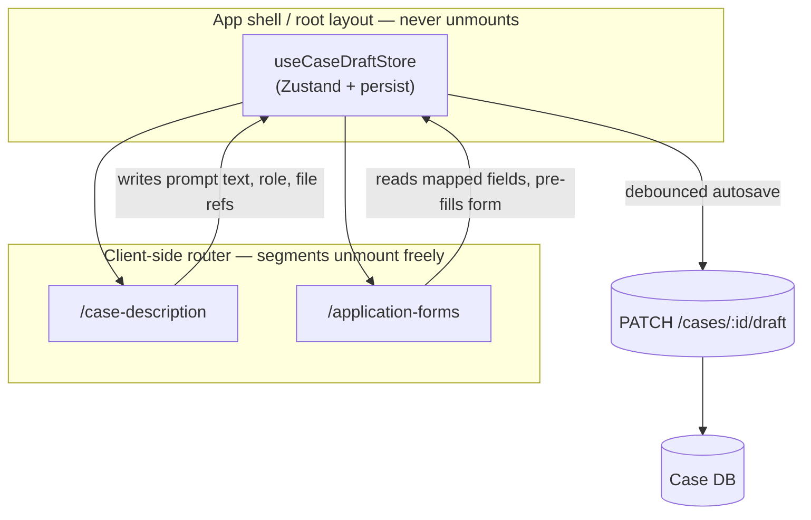
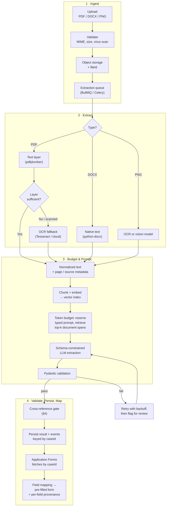
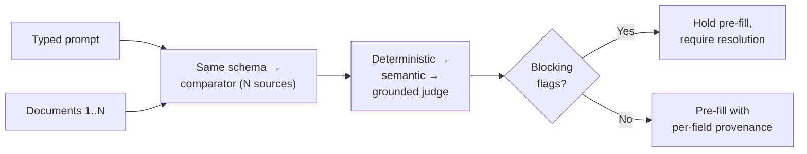

# Technical Assessment Response: Frontend State & AI Workflow Integration

**Lextar AI Document Processing Workflow — Case Description → Application Forms**
Chris Elias · A companion appendix covers the pivot strategy, compliance posture, and schemas. This document stands alone.
Numbered sections (§0–§4) are in this response, lettered ones (Appendix A–F) in the companion. Every reference is a link.

---

To close the two questions your note left open: my work at FoodLogiQ, Smile CDR, and O'Reilly has been hands-on throughout — writing and reviewing production code in the ingestion, normalization, and provenance layers I was also architecting, which is why this leans on schemas and code rather than diagrams alone. On availability, I'm looking for one substantial engagement, not a side project stacked behind other commitments. Rescue work needs someone reachable in your hours and in the codebase daily, and that's what I'd be signing up for. Per your encouragement on AI tooling, I used Claude Code to draft and diagram faster; the diagnosis and the trade-off calls are mine.

---

**Contents** — [0. Assumptions](#0-assumptions) · [1. Root Cause Analysis](#1-root-cause-analysis) ([1.1 state loss](#11-why-the-frontend-forgets-text-and-files-on-navigation) · [1.2 AI blindness](#12-why-the-ai-is-blind-to-the-uploaded-pdfs-and-pngs) · [1.3 first-hour triage](#13-confirming-this-in-the-first-hour)) · [2. Architecture & State](#2-architectural-solution--state-management) ([2.1 selection criterion](#21-the-selection-criterion-what-each-layer-must-survive) · [2.2 tools compared](#22-tools-considered-and-why) · [2.3 store shape](#23-store-placement-and-shape) · [2.4 binary uploads](#24-binary-uploads-across-page-transitions)) · [3. Data Pipeline & Error Handling](#3-data-pipeline--error-handling) · [4. Cross-Reference Validation](#4-cross-reference-validation--anomaly-detection) ([4.1 a gate](#41-a-gate-not-a-report) · [4.2 schema & provenance](#42-one-schema-with-provenance-on-every-field) · [4.3 severity](#43-severity-including-asymmetry) · [4.4 methods](#44-methods-by-category) · [4.5 string similarity](#45-choosing-a-string-similarity-metric) · [4.6 surfacing](#46-surfacing-discrepancies))

**Appendix** — [A pivot strategy](Technical-Assessment-Appendix.md#a-resource-constrained-pivot-strategy) · [B provenance & compliance](Technical-Assessment-Appendix.md#b-provenance-audit-and-canadian-compliance-posture) · [C data model](Technical-Assessment-Appendix.md#c-data-model-sketch) · [D store implementation](Technical-Assessment-Appendix.md#d-store-implementation-notes) · [E validation code](Technical-Assessment-Appendix.md#e-validation-implementations) · [F Python 3.14](Technical-Assessment-Appendix.md#f-what-python-314-actually-changes-here)

---

## 0. Assumptions

This is written without access to the repository, a running environment, logs, or the team. Everything below is inferred from the brief, the defect report, and the screenshot on page 2 — so I've listed what I assumed and what changes if I'm wrong, rather than letting those choices sit implicit in the design.

| Area | Assumption | If it's wrong |
|---|---|---|
| Diagnosis | [§1](#1-root-cause-analysis) names *candidate* causes, not confirmed ones — no repo, environment, or logs | [§1.3](#13-confirming-this-in-the-first-hour) reorders which fix ships first, not the architecture |
| Diagnosis | The page-2 screenshot is current production UI | The `accept`-filter finding drops; failure points 5–7 stand alone |
| Stack | Next.js 16.1, React 19.2, App Router, React Compiler enabled | On Pages Router the store moves to `_app.tsx` and the `<Activity>` option in [§1.1](#11-why-the-frontend-forgets-text-and-files-on-navigation) disappears |
| Stack | Postgres; Python 3.14 with Pydantic v2 (see [Appendix F](Technical-Assessment-Appendix.md#f-what-python-314-actually-changes-here)) | [Appendix C](Technical-Assessment-Appendix.md#c-data-model-sketch)'s DDL and the `Extracted[T]` syntax change; the model doesn't |
| Stack | Object storage, job queue, and vector index available or fundable | [Appendix A](Technical-Assessment-Appendix.md#a-resource-constrained-pivot-strategy) is the plan for when they aren't |
| Stack | Hosted LLM API with function calling, no access to weights | Cross-attention ([§4.4](#44-methods-by-category)) becomes viable with owned weights |
| Stack | More than one backend replica, or serverless | Failure #8 disappears on a single long-lived process |
| Domain | Canadian immigration practice; IRPR s.182 live for these users | `CaseFieldsV1` and the s.182 rule swap out; the provenance pattern doesn't |
| Domain | Application Forms has an enumerable field schema to map into | [§3](#3-data-pipeline--error-handling)'s mapping needs a form registry before [§4](#4-cross-reference-validation--anomaly-detection) is useful |
| Domain | Statutory rules in code get counsel sign-off and an effective date | A process requirement, not a code one — encoding a misread rule is worse than encoding none |
| Domain | Case data is PII and may be privileged | [Appendix B](Technical-Assessment-Appendix.md#b-provenance-audit-and-canadian-compliance-posture)'s residency and privilege posture relaxes considerably |
| Product | Upload-on-selection is acceptable; drafts exist before submit | Falls back to upload-on-submit; files can't pre-process |
| Product | A human reviewer clears blocking flags | Blocking pre-fill becomes a queue nobody drains |
| Product | Typed case text stays out of browser storage as PII | Drop `partialize` and the draft survives refresh too |
| Numbers | 6,700 tokens per 5,000 words, 0.9 fuzzy threshold, 800 ms debounce, 15 s p95 | Starting points for tuning, not derived from your data |

---

## 1. Root Cause Analysis

### 1.1 Why the frontend forgets text and files on navigation

**Case Description** and **Application Forms** are two route-level components behind a client-side router, and the form values — textarea contents and the `FileList` from `<input type="file">` — live in local state (`useState`/`useReducer`) scoped to `CaseDescription` itself.

A route change swaps the matched component, which **unmounts** the old tree: effect cleanups run, Fiber nodes are dropped, and nothing serializes anything. Navigating back mounts a **fresh instance** that re-runs its initial `useState` calls and gets defaults. The prior instance was garbage collected — nothing forgot the data so much as the object holding it ceased to exist.

Files are more fragile than text. A `File` handle is an in-memory reference tied to that DOM node: not JSON-serializable, unable to survive a `sessionStorage` round-trip, and destroyed with the input element. A fix addressing only the text would leave attachments broken.

Two variants to rule out in triage, because each changes the fix entirely.

**If the two panels are conditional renders inside one route** (`{active === 'case' && <CaseDescription/>}`) rather than separate route segments, the unmount is the same but React 19.2 offers a first-class fix. Wrapping each panel in `<Activity mode={...}>` hides it with `display: none` instead of unmounting: state is preserved, Effects are torn down and re-created, and crucially the **DOM survives too**. Because the `<input type="file">` element itself is never destroyed, its `FileList` survives with it — the one scenario where the attachment half of this bug is a few lines rather than an architecture change. React's own documentation uses a tab switcher losing textarea draft text as the canonical example. This does not extend across App Router route segments, though; the router still unmounts those, so a routed layout needs the store in [§2](#2-architectural-solution--state-management).

**If the sidebar uses a plain `<a href>` rather than `<Link>`**, that's a full document load, destroying in-memory state *and* any store with it. No state library helps until the link is fixed.

**In one line:** state lives in a component that gets unmounted, and file handles are never lifted out of the DOM into anything durable before that happens.

### 1.2 Why the AI is blind to the uploaded PDFs and PNGs

The screenshot in your brief does more diagnostic work than it appears to. The dropzone reads **"Drag & drop PDF or Word files"** and **"Supports PDF and DOCX. Typewritten text only."** The defect report has the user attaching `evidence.png`. **PNG is not an accepted type anywhere in that UI**, so before any pipeline stage runs, the `accept` attribute and the server-side MIME allowlist are prime suspects for the image never entering the system at all. "Typewritten text only" is a second admission: there is no OCR path, so a scanned PDF fails the same way.

| # | Layer | Failure mode | Assessment |
|---|---|---|---|
| 1 | File input | `accept` / MIME allowlist excludes `image/*`; PNG rejected at selection | **Most likely** — stated in the UI |
| 2 | Request assembly | File captured in state, but only the text field is appended to the request | Possible |
| 3 | Payload encoding | Body sent as `application/json`, not `multipart/form-data`; binaries dropped | Possible |
| 4 | API endpoint | Handler reads `req.body.prompt` only; no `multer`/`busboy` configured | Possible |
| 5 | Parser | Text layer extracted, scanned pages skipped, no OCR fallback; PNG never routed to OCR or a vision model | **Most likely** |
| 6 | Prompt assembly | Extraction computed but never interpolated into the final prompt | **Most likely** — matches the symptom exactly |
| 7 | Context budget | Document text truncated to fit the window while the typed prompt survives | **Most likely** — see below |
| 8 | Persistence | Extraction held in process memory; a second replica serves Application Forms nothing | Likely at any real scale |

**The asymmetric token budget (#7) is a root cause, not a caveat.** The word counter reads `0 / 5,000` and meters *only* the typed text — uploaded files are not counted against it. So the product caps its smallest input at roughly 6,700 tokens while the genuinely large one, a multi-page contract at 15–20k tokens or more, has no cap anywhere. If prompt assembly reserves the user's text and truncates document content to fit, the observable result is exactly what your report describes: *the AI focuses on the typed text prompts* and appears blind to the documents. That also means document text cannot simply be concatenated into a prompt — the pipeline needs an explicit token budget with retrieval over chunked content ([§3](#3-data-pipeline--error-handling)).

**On #8:** the intended workflow states the backend "saves the structured extraction in memory." Behind a load balancer with more than one replica, or on a serverless runtime, the Application Forms request can land on an instance that never performed the extraction — reproducing the second half of Defect 2 even when extraction worked perfectly.

### 1.3 Confirming this in the first hour

Before writing code: check whether the upload request's `Content-Type` is `multipart/form-data` and a file part is actually present; test the input's `accept` attribute against a `.png`; log the fully assembled prompt server-side and look for extracted document text in it; and confirm the extraction survives a backend restart. That sequence separates failures 1–4 from 5–8 in about twenty minutes, and it decides which fix ships first.

On Python 3.14 the backend half gets easier: `pdb` can attach to a live process and PEP 768's external debugger interface lets you inspect in-flight asyncio tasks without a restart. That matters when the symptom is "extraction silently hangs" rather than "extraction throws," which is the harder of the two to reproduce locally.

---

## 2. Architectural Solution & State Management

### 2.1 The selection criterion: what each layer must survive

Tool choice falls out of durability requirements rather than preference:

| Must survive | Requires | Relevant to |
|---|---|---|
| Component unmount on navigation | Any store instantiated **above** the router | Defect 1, directly |
| Tab refresh | Serialization to `sessionStorage` / `localStorage` / IndexedDB | Accidental reload |
| A second tab | Rules out `sessionStorage`, which is per-tab | Multi-tab review |
| Device or session change | Server-side persistence keyed by `caseId` | The real durability answer |

The reported defect only requires tier one. An in-memory store above the router fixes it outright; everything below is hardening.

### 2.2 Tools considered, and why

**Zustand** for the client draft, **TanStack Query** for server state, Postgres as the source of truth.

- **Zustand (selected).** A module-level store created outside the component tree, so a route change structurally cannot unmount it. Selector subscriptions mean `useCaseDraftStore((s) => s.promptText)` re-renders only what reads that slice — which matters for a textarea firing on every keystroke. `persist` middleware supplies tier two without hand-rolled serialization.
- **Redux Toolkit + `redux-persist`.** The right call if the org already standardizes on Redux, where devtools and time-travel debugging genuinely help during a rescue. For a single case-draft object it's more ceremony than the problem needs, so I'd adopt it for codebase consistency, not on merits here.
- **Context API.** Solves placement and prop-drilling, honestly half the problem — a Provider above the routes does survive the unmount. It lacks serialization, persistence, and selector granularity: every consumer re-renders when the provider's value changes, the wrong default for per-keystroke updates. React Compiler doesn't change that — it removes manual `useMemo`/`useCallback`, but a component calling `useContext` still re-renders on any change to that value regardless of which field it reads. Context plus `useReducer` plus a hand-written storage sync converges on what Zustand already ships.
- **Browser storage is three tools, not one.** `sessionStorage` (~5MB, per-tab, cleared on close) suits a draft that shouldn't outlive the session. `localStorage` (~5–10MB, shared across tabs) writes client PII to disk indefinitely — wrong posture for case data. IndexedDB is the only tier large and async enough to buffer file bytes. None has a reactivity model, so none replaces a store.
- **TanStack Query** is complementary, not competing: it owns the server cache — autosave mutations, status polling, refetch on focus — while Zustand owns the local draft. That boundary avoids duplicating server data into a client store and then fighting to keep it fresh.
- Not selected: URL/search-param state (unbounded prompt text doesn't belong in a URL) and Jotai/Valtio (fine, no advantage here).

### 2.3 Store placement and shape

The load-bearing move is placing the store **above the router boundary** — the root `layout.tsx`, which persists across route-segment changes while page segments unmount. The store module carries `'use client'`; both pages are Client Components regardless, since both are interactive forms.



```typescript
'use client';
// stores/useCaseDraftStore.ts — module singleton, created above the router
type FileStatus = 'uploading' | 'uploaded' | 'queued'
                | 'extracting' | 'analyzing' | 'ready' | 'failed';

export const useCaseDraftStore = create<CaseDraftState>()(
  persist(
    (set, get) => ({
      caseId: null, promptText: '', analysisRole: 'legal_analyst',
      files: [] as UploadedFileRef[],   // { fileId, filename, mimeType, sizeBytes, status }

      // Mint the id client-side (UUIDv7) so a file can be attached before any
      // round-trip; the first server write upserts, making retries idempotent.
      ensureCaseId: () => get().caseId ?? (set({ caseId: uuidv7() }), get().caseId!),

      setPromptText: (t) => set({ promptText: t }),
      setAnalysisRole: (r) => set({ analysisRole: r }),
      addFile: (f) => set((s) => ({ files: [...s.files, f] })),
      removeFile: (id) => set((s) => ({ files: s.files.filter((f) => f.fileId !== id) })),
      setFileStatus: (id, status) =>
        set((s) => ({ files: s.files.map((f) => f.fileId === id ? { ...f, status } : f) })),
      reset: () => set({ caseId: null, promptText: '', files: [] }),
    }),
    {
      name: 'lextar-case-draft',
      storage: createJSONStorage(() => sessionStorage),
      // sessionStorage is absent during server rendering, and rehydrating in
      // render causes a hydration mismatch — rehydrate from an effect instead.
      skipHydration: true,
      // promptText is deliberately NOT written to the browser: per your own
      // placeholder it carries client names and permit details. It lives in
      // memory (all Defect 1 requires) and is autosaved server-side.
      partialize: (s) => ({ caseId: s.caseId, analysisRole: s.analysisRole, files: s.files }),
    }
  )
);
```

`analysisRole` mirrors the four roles in your UI, since the selected role changes how extracted data should be framed and belongs in the same durable draft.

On Next 16 the autosave and upload endpoints can be Server Functions rather than route handlers — same contract, less boilerplate, typed end to end. I've drawn them as routes because the extraction backend is likely the Python service rather than Next, and I'd rather the frontend talk to one API surface than two.

### 2.4 Binary uploads across page transitions

`File` objects should never enter frontend state past the moment of selection. On selection, stream immediately to `POST /cases/:id/files` (or a presigned S3/GCS URL) rather than waiting for form submission. The backend persists the bytes and returns a **serializable** reference — `{ fileId, filename, mimeType, sizeBytes, status }` — and only that reference enters the store: small, JSON-safe, independent of the browser's in-memory handle. Application Forms never needs the bytes; it resolves `fileId`s against the backend for status and results. `useOptimistic` renders the file row at `uploading` the instant it's selected, so the list never lags the user's action while the request is in flight. For resilience mid-upload, an IndexedDB queue (`idb-keyval`) can hold not-yet-uploaded bytes so an interrupted upload resumes — hardening, not required for the core fix.

This addresses both defects at once: nothing large or unserializable sits in component state, and files begin processing the moment they're selected, decoupled from whatever the user does next.

---

## 3. Data Pipeline & Error Handling



Four decisions carry this. **Extraction is asynchronous** — OCR and LLM calls take seconds to minutes, so the upload endpoint returns a `fileId` and status immediately rather than blocking. **The server is the source of truth, keyed by `caseId`**, making Application Forms independent of anything a component held in memory and fixing failure #8. **The token budget is explicit**: the typed prompt gets a fixed reservation and document content is retrieved rather than concatenated, so growth in document size degrades retrieval quality instead of silently discarding evidence. **LLM output is schema-constrained** through function calling with Pydantic validation, so malformed output is caught rather than quietly corrupting form fields.

**On prompt assembly specifically** — failure #6 above, and the point where third-party document text meets your instructions. Python 3.14's t-strings (PEP 750) fit this well: unlike an f-string, a `Template` keeps static and interpolated parts separate, so the assembler can tag, delimit, or escape document-derived spans as *data* instead of concatenating them into the instruction stream. That isn't prompt-injection protection on its own, but it gives you one seam to enforce a policy at rather than trusting every call site to remember. In a system whose inputs are documents supplied by opposing parties, that seam is worth having.

**Lifecycle visibility.** A user should never wonder whether the system saw their file. Each file carries a status rendered as a badge — `Uploading → Uploaded → Queued → Extracting → Analyzing → Ready`, with `Failed` reachable from any stage and retry returning it to `Queued`. Because status comes from the shared store plus polling or SSE rather than local state, the same case-level indicator appears on **both** pages. Rejected file types raise an explicit error at selection instead of silent omission — that alone would have surfaced Defect 2 months earlier — completion and failure raise toasts, and every pre-filled field is marked with its origin ("AI-filled from contract.pdf, p.3") so AI-filled and hand-edited values stay distinguishable.

---

## 4. Cross-Reference Validation & Anomaly Detection

### 4.1 A gate, not a report

Validating that the Case Description text lines up with the uploaded files is a **blocking step before pre-fill**, not a report produced alongside it. Nothing reaches a form field until the comparison has run and every blocking flag has been resolved by a person.



### 4.2 One schema, with provenance on every field

Two decisions in this schema are what make the comparison above possible.

**Both sides target the same shape.** The typed prompt and each uploaded document are extracted into `CaseFieldsV1` — same fields, same types. That converts "does the description line up with the files?" from re-parsing free text on every check into a field-by-field comparison of typed objects, which is what lets the deterministic checks in [§4.4](#44-methods-by-category) run at all.

**Every field carries its own value, confidence, and provenance**, rather than the extraction carrying one of each. The difference is between knowing *"this extraction is 0.8 confident and came from contract.pdf"* and knowing *"`status_expiry_date` is 0.62 confident, read from 'valid until 12 March 2025' on page 3."* Only the second can support the per-field origin tooltip in [§3](#3-data-pipeline--error-handling), flagging one field while the rest pre-fill normally ([§4.3](#43-severity-including-asymmetry)), or answering months later where one specific value came from.

```python
class Provenance(BaseModel):
    source: str                  # "prompt" | fileId
    page: int | None = None
    quote: str                   # the verbatim span this value was read from

class Extracted[T](BaseModel):
    value: T | None = None
    confidence: float = Field(ge=0, le=1)   # no default; the model must commit
    provenance: Provenance | None = None

class CaseFieldsV1(BaseModel):
    client_name:        Extracted[str]
    jurisdiction:       Extracted[str]
    status_expiry_date: Extracted[date]
    refusal_date:       Extracted[date]     # shifts the s.182 clock start
    case_type:          Extracted[Literal["restoration", "extension", "appeal", "other"]]
```

`quote` holds the verbatim span a value was read from — kept not for display but because [§4.4](#44-methods-by-category) verifies it against the source text before trusting anything derived from it. `Extracted[T]` is a generic wrapper, so `Extracted[date]` still validates as a date while carrying its metadata alongside.

### 4.3 Severity, including asymmetry

Because uploaded files aren't counted against the 5,000-word limit, the realistic input is a short description alongside a large document set. The two sides are rarely symmetric, so most misalignment is **not** a head-on contradiction, and a taxonomy built only around contradictions misses the dangerous cases:

| Severity | Meaning | Blocks pre-fill |
|---|---|---|
| `contradiction` | Both sides state a value and they disagree | Yes |
| `unsupported_claim` | The prompt asserts something no document corroborates | Yes, for material fields |
| `document_only` | A document holds a material fact the prompt never mentions | Yes — flag prominently |
| `missing_field` | Required by the target form, absent from every source | No; prompt for manual entry |
| `low_confidence` | Extracted, but below threshold | No; mark for review |

```python
class DiscrepancyFlag(BaseModel):
    field: str
    severity: Literal["contradiction", "unsupported_claim",
                      "document_only", "missing_field", "low_confidence"]
    claims: list[Claim]          # {source, value, provenance} — N sources
    blocks_prefill: bool
```

Modelling a flag as a list of claims rather than a `prompt_value`/`document_value` pair is what lets one comparator also handle **document-versus-document** conflicts: two uploaded permits with different expiry dates yield a single flag with two claims and no prompt claim at all.

**A worked example from your own placeholder text.** It reads *"My client's study permit expired 45 days ago… restoration of status under IRPR s.182."* Section 182(1) allows 90 calendar days to apply, and the Federal Court has held that officers have no discretion to extend it. So if the prompt says 45 days but the uploaded permit shows 120, that's a `contradiction` that changes eligibility — caught deterministically from two dates, with no model involved. The subtler case is `document_only`: the client uploads an IRCC refusal letter they never mentioned, which moves the clock start from the expiry date to the day after the refusal. Nothing contradicts anything; they simply didn't mention the document that moved the deadline. A comparator looking only for contradictions ships an out-of-time filing. (Implementation in [Appendix E](Technical-Assessment-Appendix.md#e-validation-implementations).)

### 4.4 Methods, by category

- **Deterministic first, because it's cheap and certain.** Pydantic/JSON Schema validation for required-field presence and type conformance; normalizing dates to ISO-8601 before comparison so "45 days ago" resolves against an explicit date in the PDF; codified statutory rules like the s.182 check above; and approximate string matching for names and identifiers, where the choice of metric matters enough that [§4.5](#45-choosing-a-string-similarity-metric) covers it separately. Anything answerable this way should never reach a model.
- **Semantic comparison for narrative fields.** Embedding cosine similarity as a cheap first pass to find which statements are *about* the same thing, then a **Natural Language Inference** classifier over those pairs for entailment / contradiction / neutral. The ordering matters: similarity tells you two statements are topically related, never that they disagree. NLI is built for contradiction specifically.
- **A grounded LLM judge, verified.** A verifier prompt separate from the extraction call — so the same failure mode isn't grading its own work — receives both structured objects plus source spans and returns schema-validated flags. Requiring a citation is necessary but *not sufficient*: a required string field catches a missing citation, not a fabricated one, and a model can invent a plausible quote that validates cleanly. So each cited span is checked against the real source before the flag is accepted:

```python
@model_validator(mode="after")
def citations_must_exist(self, info):
    corpus = info.context["source_text_by_id"]
    for c in self.claims:                       # fuzzy, since OCR text drifts
        if fuzz.partial_ratio(c.provenance.quote, corpus.get(c.provenance.source, "")) < 90:
            raise ValueError(f"cited span not present in {c.provenance.source}")
    return self
```

  A flag that can't be traced to real text fails validation and never reaches the UI. Malformed responses trigger a bounded retry (Instructor, or `model_validate` with a retry wrapper) rather than corrupting the report. `partial_ratio` is deliberate here rather than the Levenshtein call in [§4.5](#45-choosing-a-string-similarity-metric): this task is locating a span inside a long document, so substring alignment is the property that matters and the drift is transcription-level, not the character substitution you get on a short fixed-format identifier.
- **RAG evaluation as a regression harness.** Because [§3](#3-data-pipeline--error-handling) retrieves document spans rather than concatenating them, retrieval quality becomes a correctness risk — a missed chunk looks identical to a missing field. I'd keep a labelled fixture set of case packets and score every pipeline change offline with RAGAS or DeepEval on **context recall** (did retrieval surface the span containing the answer) and **faithfulness** (is each extracted value grounded in retrieved context). That turns "the AI got worse after we changed the chunker" from a support ticket into a failing build — the difference between a demo and something defensible in a government review.
- **On cross-attention specifically.** Inspecting attention weights is a model-internals interpretability technique — real, but available only when you control the weights, as with a fine-tuned encoder over prompt/document pairs. It isn't exposed by a hosted API, and attention maps are weak evidence of causal attribution even when you have them. The production equivalent is the grounded judge above: functionally "attend across both sources," done through prompting, and unlike an attention map it yields a citation a human can check.

### 4.5 Choosing a string-similarity metric

Edit distance and token-set ratio are often named in the same breath, but they measure different things and are not substitutes. Comparing a permit number and comparing a client's name are different problems; using one metric for both yields false mismatches in one direction and false matches in the other.

**Edit distance, for fixed-format identifiers.** Case numbers, UCI numbers, permit numbers and file numbers have fixed structure and no meaningful word order, and the errors that actually occur are OCR character confusions — `0`/`O`, `1`/`l`/`I`, `5`/`S`, `rn`/`m`. Those are **substitutions**, which is exactly what Levenshtein distance counts.

One detail bites in practice: `rapidfuzz.fuzz.ratio` is *not* Levenshtein. It computes normalized **Indel** similarity, which permits only insertions and deletions, so every substitution costs 2 (a delete plus an insert) instead of 1. Used on identifiers it systematically over-penalizes the precise error class you expect from OCR. Call `rapidfuzz.distance.Levenshtein` explicitly rather than reaching for `fuzz.ratio` out of habit.

Thresholds need the same care. On short identifiers a percentage is misleading — one wrong character in a ten-character permit number still scores 90%, but it is a different permit. Compare absolute distance, and treat a near-match as a question rather than an answer:

```python
from rapidfuzz.distance import Levenshtein

def compare_identifier(a: str, b: str) -> Severity | None:
    a, b = normalize_ocr(a), normalize_ocr(b)   # case, separators, confusion classes
    d = Levenshtein.distance(a, b)
    if d == 0:
        return None                # same identifier
    if d <= 2:
        return "low_confidence"    # OCR noise, or a genuinely different number — ask
    return "contradiction"         # different identifier
```

**Token-set ratio, for person and organization names.** Names reorder ("Smith, John" against "John Smith"), gain and lose middle names and initials, and carry honorifics and corporate suffixes. Edit distance reads reordering as near-total dissimilarity and produces false mismatches, so the token set is the right primitive: `token_set_ratio` compares the intersection and the remainders, which makes word order irrelevant.

Its documented behaviour is also its trap. **Token-set ratio returns 100 when one string is a subset of the other, regardless of the extra tokens** — `token_set_ratio("John Smith Jr", "John Smith")` is a perfect match. In a legal filing "Jr" is not noise; it may be a different person, and two family members on one matter is not a rare scenario. So token-set is a candidate finder, not a verdict: take the match, then diff the residual tokens and treat a non-empty residue as a flag rather than discarding it. `token_sort_ratio` sits between the two — order-insensitive, but it does penalize extra tokens, which makes it the safer default wherever you don't positively expect subset relationships.

**Normalize before either.** An OCR-aware normalization pass — case folding, stripping separators and diacritics, mapping known confusion classes — is worth more than the choice of metric, because it removes the noise rather than tolerating it.

**And neither asserts equality.** A fuzzy match in this system produces a `low_confidence` or `contradiction` flag for a person to resolve ([§4.3](#43-severity-including-asymmetry)). It never silently merges two values: the cost of wrongly merging two clients' identifiers is nowhere near symmetric with the cost of asking.

### 4.6 Surfacing discrepancies

Flags render inline beside the affected field, showing each conflicting value with its source ("prompt" versus "contract.pdf p.3") and a one-line explanation. Blocking severities leave the field **empty** with a warning rather than silently picking a winner, and require an explicit decision recorded against the resolver's identity — appended rather than overwriting the previous one, since a resolved flag can be re-raised when a later document arrives ([Appendix B](Technical-Assessment-Appendix.md#b-provenance-audit-and-canadian-compliance-posture)). Non-blocking flags pre-fill but stay visually marked. The principle throughout: the system never resolves a legal ambiguity on the user's behalf, and never hides that one existed.

---

The [companion appendix](Technical-Assessment-Appendix.md) carries what didn't belong in a response of this length: how I'd stage this under a compressed timeline with no infrastructure budget, the provenance and Canadian data-residency posture the government Proof of Value implies, the data model, and full implementations of the store and validators. I'd be glad to walk through any of it.
