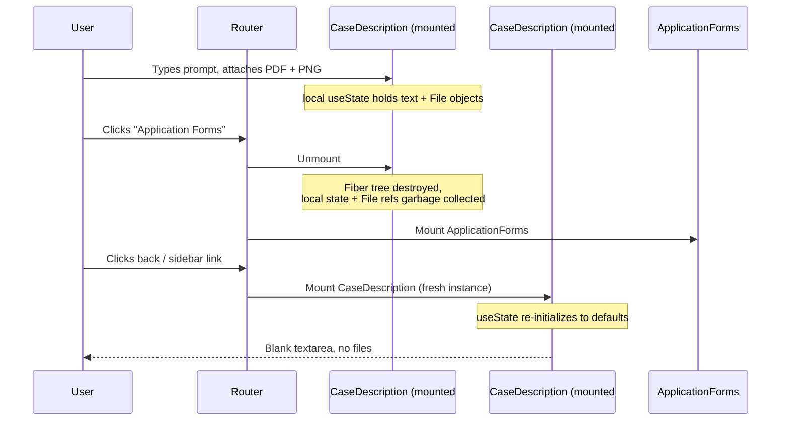
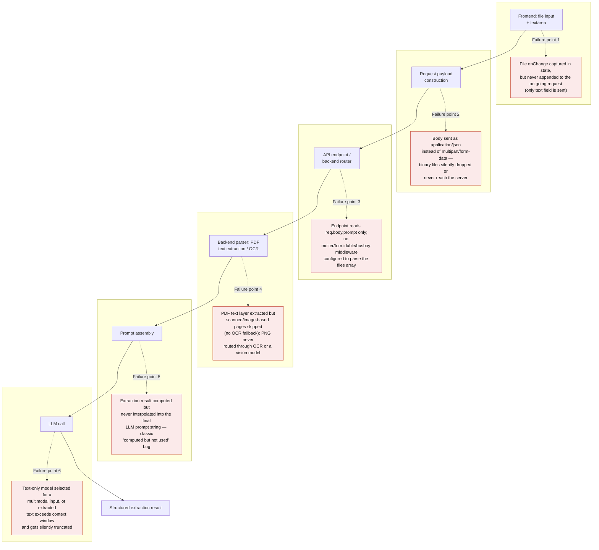
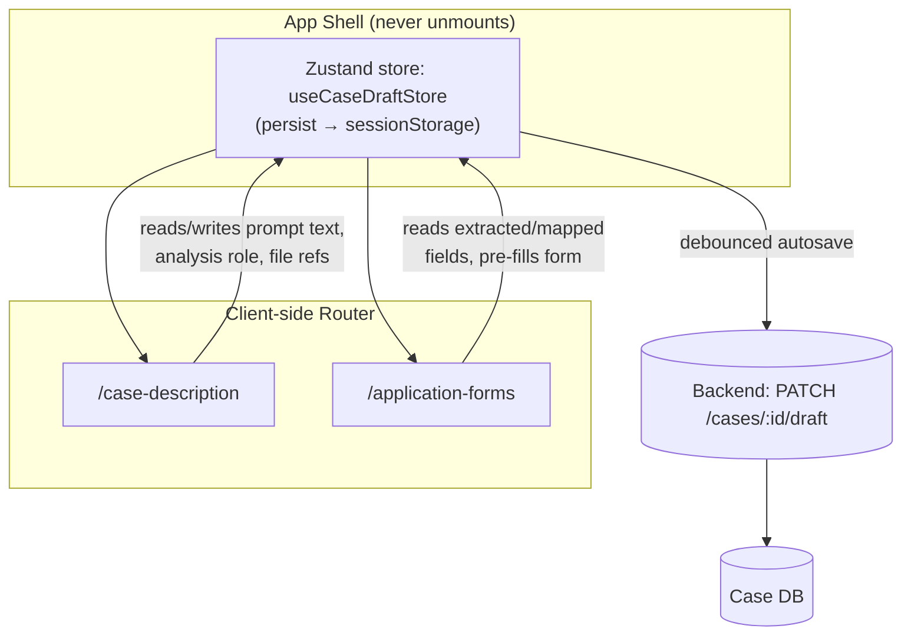
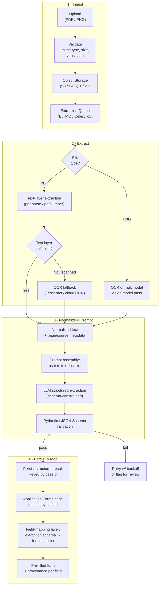
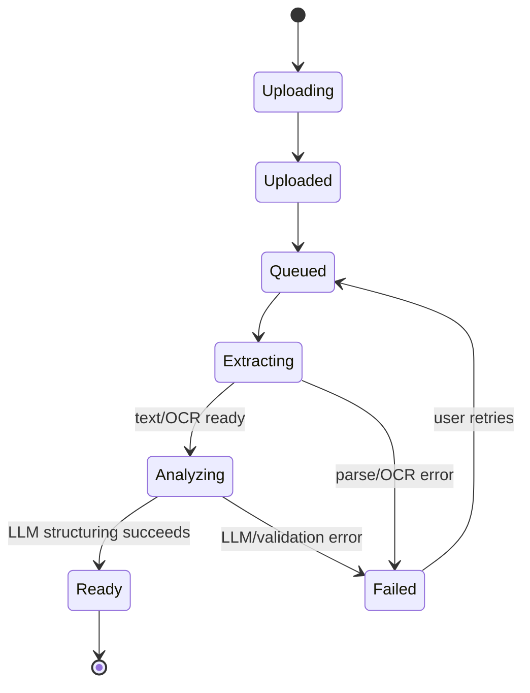
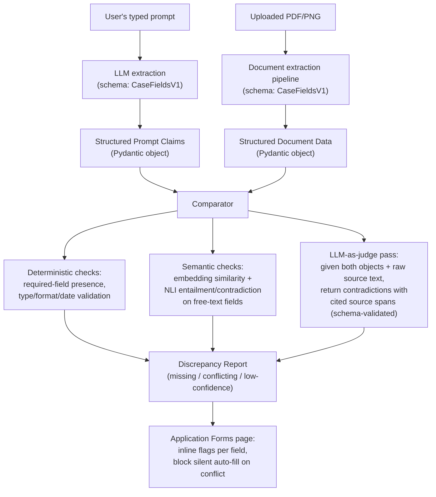

# Technical Assessment Response: Frontend State & AI Workflow Integration

**Scenario:** Lextar AI Document Processing Workflow — Case Description → Application Forms

---

## Table of Contents

- [A note on hands-on coding, and how this response was built](#a-note-on-hands-on-coding-and-how-this-response-was-built)
- [1. Root Cause Analysis (RCA)](#1-root-cause-analysis-rca)
  - [1.1 Why the frontend "forgets" text and files on navigation](#11-why-the-frontend-forgets-text-and-files-on-navigation)
  - [1.2 Why the AI is "blind" to PDFs/PNGs](#12-why-the-ai-is-blind-to-pdfspngs)
- [2. Architectural Solution & State Management](#2-architectural-solution--state-management)
  - [2.1 Lifting and persisting state](#21-lifting-and-persisting-state)
  - [2.2 Handling binary file uploads across page transitions](#22-handling-binary-file-uploads-across-page-transitions)
- [3. Data Pipeline & Error Handling](#3-data-pipeline--error-handling)
  - [3.1 End-to-end pipeline](#31-end-to-end-pipeline)
  - [3.2 UX indicators for the extraction lifecycle](#32-ux-indicators-for-the-extraction-lifecycle)
- [4. Cross-Reference Validation & Anomaly Detection](#4-cross-reference-validation--anomaly-detection)
  - [4.1 Design](#41-design)
  - [4.2 Specific methods, by category](#42-specific-methods-by-category)
  - [4.3 UX for flagged discrepancies](#43-ux-for-flagged-discrepancies)
- [5. Resource-Constrained Pivot Strategy](#5-resource-constrained-pivot-strategy)
- [6. Provenance, Audit, and Government Proof-of-Value Considerations](#6-provenance-audit-and-government-proof-of-value-considerations)

---

### A note on hands-on coding, and how this response was built

Across FoodLogiQ, Smile CDR, and O'Reilly, my day-to-day has been hands-on: writing and reviewing production code in the same systems I was architecting — ingestion pipelines, normalization layers, and the provenance/audit logic that had to hold up under compliance review, not just design review. Architecture decisions on those platforms weren't made from a whiteboard; they came out of shipping something and then fixing what broke in it. That's the lens this response is written from, which is why it leans on concrete code and schemas below (§2.1, §4.1) rather than diagrams alone.

In the interest of transparency, and per your own encouragement to use modern AI tooling: I used Claude Code to accelerate drafting and diagramming this response. The root-cause diagnosis, the architecture and trade-off calls, and the framing of what actually breaks in this scenario are mine, drawn from doing this kind of document-ingestion rescue work before — the tool moved faster, it didn't do the thinking.

Given that this role anchors upcoming government Proof of Value work, I've added a short section on the provenance/audit posture this design treats as non-negotiable (§6), and a section on how I'd pivot the architecture if infrastructure or timeline were suddenly constrained (§5), since I expect that kind of pivot to come up directly in our next conversation.

---

## 1. Root Cause Analysis (RCA)

### 1.1 Why the frontend "forgets" text and files on navigation

The most likely cause is that **Case Description** and **Application Forms** are two separate route-level components in the client-side router (e.g., two Next.js pages/route segments), and the form fields (`textarea`, `<input type="file">` selection) are held in **local component state** (`useState`/`useReducer`) scoped to the `CaseDescription` component itself.

In React, a route change that swaps out the matched component **unmounts** the old component tree. Unmounting destroys all local state and Fiber nodes — there is no automatic serialization or persistence step. When the user navigates back, the router mounts a **fresh instance** of `CaseDescription`, which re-runs its initial `useState`/`useReducer` calls and gets back default/empty values. Nothing "remembers" the previous instance; it was garbage collected.

File uploads are actually more fragile than text: even if the text were persisted, a browser `File`/`FileList` object obtained from an `<input type="file">` is an **in-memory handle scoped to that DOM node**. It is not serializable to JSON, cannot survive `localStorage`/`sessionStorage` round-trips, and does not persist across a route/component swap because the input element itself is destroyed and recreated.



**Root cause in one line:** state lives in a component that gets unmounted, and file handles are never lifted out of the DOM/component into anything durable before that unmount happens.

### 1.2 Why the AI is "blind" to PDFs/PNGs

Because there are four independent layers involved, "blindness" can originate at any of them — and in practice it is usually more than one:



Given the screenshot in the report shows an "Upload Documents" dropzone that says **"Supports PDF and DOCX. Typewritten text only"** — this is a strong hint the actual bug is a combination of **Failure point 4** (no OCR/vision fallback — the system explicitly disclaims scanned/handwritten content) and **Failure point 5** (extracted text is computed server-side but the prompt-assembly step that merges it with the user's typed prompt is broken or missing), which matches Defect 2's description of the AI "focusing on the typed text prompts" as if the document extraction never happened.

---

## 2. Architectural Solution & State Management

### 2.1 Lifting and persisting state

The fix is to stop treating `CaseDescription`'s form state as local, and instead treat the **case** as a durable entity that outlives any single component's mount lifecycle. Three complementary layers:

| Layer | Tool | Role |
|---|---|---|
| In-memory global store | **Zustand** | Single source of truth for the active case draft, shared by both pages without prop drilling |
| Client-side durability | `zustand/middleware` **persist**, backed by `sessionStorage` | Survives route swaps and accidental refresh within the tab session |
| Server-side durability | Debounced autosave to backend (`PATCH /cases/:id/draft`) | Source of truth across devices/tabs/sessions; the real fix for large payloads |

**Why Zustand over the alternatives:**
- **Redux/Redux Toolkit** is a reasonable choice too (and preferable if the org already standardizes on it for devtools/middleware consistency across a larger app), but it's more boilerplate than this problem needs — a single "current case draft" slice doesn't need action creators, reducers, and a store setup for what is fundamentally one object.
- **Context API alone** is not a solution here — Context doesn't persist anything either; it only solves prop-drilling. Using Context without a store still loses state on unmount unless the Provider lives above the routes that unmount (which is possible, but Zustand gives the same "lives above the router" placement plus built-in persistence middleware and selector-based re-render control for free).
- **Raw Browser Storage (`localStorage`/`sessionStorage`) alone**, without a store, works for small string fields but has no reactivity model, a ~5–10MB quota (too small for attached PDFs), and no structured update API — you'd end up hand-rolling what Zustand's persist middleware already does.

The key architectural move is **placing the store provider above the router boundary** (e.g., in `_app.tsx` / the root layout) so the store instance itself is never unmounted when the route changes — only the page components that *read* from it are.

```typescript
// stores/useCaseDraftStore.ts — module-level singleton, instantiated once above the router
import { create } from 'zustand';
import { persist, createJSONStorage } from 'zustand/middleware';

interface UploadedFileRef {
  fileId: string;
  filename: string;
  mimeType: string;
  sizeBytes: number;
  status: 'uploading' | 'uploaded' | 'extracting' | 'ready' | 'failed';
}

interface CaseDraftState {
  caseId: string | null;
  promptText: string;
  analysisRole: 'legal_analyst' | 'counsel_applicant' | 'counsel_respondent' | 'adjudicator';
  files: UploadedFileRef[];
  setPromptText: (text: string) => void;
  addFile: (file: UploadedFileRef) => void;
  updateFileStatus: (fileId: string, status: UploadedFileRef['status']) => void;
}

export const useCaseDraftStore = create<CaseDraftState>()(
  persist(
    (set) => ({
      caseId: null,
      promptText: '',
      analysisRole: 'legal_analyst',
      files: [],
      setPromptText: (text) => set({ promptText: text }),
      addFile: (file) => set((s) => ({ files: [...s.files, file] })),
      updateFileStatus: (fileId, status) =>
        set((s) => ({
          files: s.files.map((f) => (f.fileId === fileId ? { ...f, status } : f)),
        })),
    }),
    {
      name: 'lextar-case-draft',
      storage: createJSONStorage(() => sessionStorage),
      // File objects never enter this store to begin with (see §2.2) — only
      // JSON-safe refs — so a plain persist() is enough; no custom serializer needed.
    }
  )
);
```

Both `CaseDescription` and `ApplicationForms` import the same `useCaseDraftStore` hook and select only the slices they need (e.g., `useCaseDraftStore((s) => s.promptText)`), so a keystroke on one page doesn't re-render the other page even though they share state.



### 2.2 Handling binary file uploads across page transitions

`File` objects cannot be persisted in `sessionStorage`/`localStorage` (not JSON-serializable, size-prohibitive). The correct pattern is to **not keep the file itself in frontend state at all** past the moment of selection:

1. On file selection, immediately stream the file to the backend via a dedicated `POST /cases/:id/files` (or a presigned S3/GCS upload URL) — don't wait for the user to submit the whole form.
2. The backend stores the raw bytes in object storage and returns a lightweight, **serializable** reference: `{ fileId, filename, mimeType, sizeBytes, status: "uploaded" }`.
3. Only this reference object goes into the Zustand store (and therefore into `sessionStorage`/the autosave payload) — small, JSON-safe, and independent of the browser's in-memory `File` handle.
4. The **Application Forms** page never needs the actual bytes; it only needs the `fileId`s to look up processing status/results from the backend.
5. For resilience against a page refresh mid-upload, an `IndexedDB`-backed queue (e.g., via `idb-keyval`) can hold not-yet-uploaded files locally so an interrupted upload can resume — this is optional hardening, not required for the core bug fix.

This single change fixes both defects simultaneously: state loss is solved because nothing large or unserializable lives in component state, and "AI blindness" is mitigated because files are pushed to the backend (and can start processing) the moment they're selected, decoupled from whatever the user does on the frontend afterward.

---

## 3. Data Pipeline & Error Handling

### 3.1 End-to-end pipeline



Key design decisions embedded in this pipeline:
- **Async job queue, not a synchronous request/response.** OCR and LLM calls can take seconds to minutes; the upload endpoint should return immediately with a `jobId`/`fileId` and status, not block the HTTP request.
- **Server as source of truth, keyed by `caseId`.** The Application Forms page doesn't depend on anything the Case Description component held in memory — it independently fetches the latest extraction result for the case. This is what makes the pipeline robust to navigation, refresh, and even a different browser tab/device.
- **Schema-constrained LLM output** (Pydantic models on the backend, or a JSON Schema passed via function calling/tool use) instead of free-form text parsing, so malformed output is caught immediately rather than silently corrupting form fields.

### 3.2 UX indicators for the extraction lifecycle

A user should never wonder "did it see my file?" A per-file, per-case status model surfaced as a stepper/badge solves this:



Concretely: a status badge per attached file (`Uploading → Extracting → Analyzing → Ready/Failed`), a case-level progress indicator visible on both pages (since it's driven by the shared store + backend polling/SSE, not local state), toast notifications on completion/failure, and on the Application Forms page each pre-filled field is visually marked (e.g., a subtle highlight + "AI-filled from contract.pdf, p.3" tooltip) so the user can trace *why* a field has the value it does, and easily distinguish AI-filled vs. manually-edited fields.

---

## 4. Cross-Reference Validation & Anomaly Detection

### 4.1 Design

Treat both inputs as **structured, comparable objects** rather than raw text, then diff them programmatically before anything reaches the form:

1. Run the user's typed prompt through the same structured-extraction step as the documents (a lightweight LLM call constrained to the same Pydantic/JSON schema — e.g., `client_name`, `filing_date`, `permit_expiry_date`, `jurisdiction`, etc.).
2. Run the document extraction through the identical schema.
3. Now both sides are typed, field-aligned objects — comparable **without** re-parsing free text every time.

```python
# schemas/case_fields.py — the one schema both extraction paths target
from pydantic import BaseModel, Field
from datetime import date
from typing import Literal

class CaseFieldsV1(BaseModel):
    client_name: str | None = None
    jurisdiction: str | None = None
    filing_date: date | None = None
    permit_expiry_date: date | None = None
    case_type: Literal["restoration_of_status", "extension", "appeal", "other"] | None = None
    confidence: float = Field(ge=0, le=1, default=1.0)
    source_span: str | None = None  # verbatim quote / page ref this field came from

class DiscrepancyFlag(BaseModel):
    field: str
    prompt_value: str | None
    document_value: str | None
    severity: Literal["contradiction", "missing_field", "low_confidence"]
    source_citation: str  # required, not optional — forces the judge model to ground every flag
```

`source_citation` being non-optional on `DiscrepancyFlag` is the load-bearing detail: Pydantic rejects any judge-model response that flags a conflict without pointing to where it came from, so an ungrounded hallucination fails validation instead of reaching the UI.



### 4.2 Specific methods, by category

- **Programmatic / deterministic (cheap, run first):** Pydantic/JSON Schema validation to catch missing required fields outright; type and format normalization (e.g., all dates parsed to ISO-8601 before comparison) so `"45 days ago"` in the prompt can be resolved against an explicit `expiry_date` in the PDF; direct equality or fuzzy string matching (Levenshtein/token-set ratio) for short structured fields (names, IDs, case numbers).
- **Semantic comparison (for free-text/narrative fields):** embedding similarity (cosine distance between sentence embeddings) as a cheap first-pass "these two statements are probably about the same thing" filter, followed by a **Natural Language Inference (NLI)** classifier (entailment / contradiction / neutral) — NLI is the right tool specifically for *contradiction* detection, whereas embedding similarity alone only tells you topical relatedness, not whether two statements disagree.
- **AI prompting strategy — grounded LLM-as-judge:** a dedicated verifier prompt (separate call from the extraction call, to avoid the same failure mode marking its own work) that receives both structured objects plus the original source text/pages, and is required to return a strict, Pydantic-validated JSON list of `{field, prompt_value, document_value, severity, source_citation}`. Requiring a **source citation** (a quote or page reference) for every flagged item is the key defensive step — it forces the model to ground its claim in actual text rather than hallucinating a conflict, and gives the reviewing user something to verify against.
- **On "Cross-Attention" specifically:** true cross-attention weight inspection is a model-internals interpretability technique, useful if you're fine-tuning a custom encoder over prompt+document pairs, but it isn't something you get access to (or need) when calling a hosted LLM API. For a production system, the pragmatic equivalent is the LLM-as-judge pass above — it's functionally "let the model attend across both sources," just done via prompting rather than internal attention weights, and it's inspectable/auditable, unlike raw attention maps.
- **Guardrails:** wrap the verifier call with schema-enforcing libraries (e.g., Instructor, Guardrails AI, or plain Pydantic `model_validate` with retry-on-failure) so a malformed judge response triggers an automatic retry rather than corrupting the discrepancy report.

### 4.3 UX for flagged discrepancies

Severity-tiered flags (`contradiction` / `missing_field` / `low_confidence`) rendered inline next to the relevant Application Forms field, each showing both conflicting values and their source (prompt vs. `contract.pdf p.3`). Hard contradictions block auto-fill of that specific field (leave it blank with a warning rather than silently picking one source) and require explicit user resolution; missing-field flags simply prompt the user to fill the gap manually.

---

## 5. Resource-Constrained Pivot Strategy

The architecture above is the target state. If I were dropped into this as immediate rescue work — tight timeline, no dedicated infra budget yet, small team — I wouldn't build all of it before shipping a fix. Each corner below is cut deliberately, and each is isolated behind an interface (`fileId`, the `CaseFieldsV1` schema, the file `status` enum) that doesn't change when the corner gets un-cut later:

- **No Redis/BullMQ available yet:** run extraction synchronously inside the upload request handler behind a loading state, and cap accepted file size/page count to keep p95 latency tolerable (e.g., under ~15s). The frontend still polls a `fileId` for status — swapping in an actual queue later is a backend-only change.
- **No OCR/vision infra stood up:** send the PDF/PNG directly to the LLM vendor's native multimodal document support instead of standing up Tesseract + a routing layer. Costs more per call, but removes an entire pipeline stage — the right trade when the priority is "fix Defect 2 this week," not "run this cheaply at scale."
- **No object storage provisioned:** store file bytes as a `bytea`/BLOB column in whatever Postgres instance already exists (with a hard size cap), keyed by the same `fileId`. Migrating to S3/GCS later doesn't touch the frontend or the schema, only the storage adapter.
- **No time for full autosave + cross-device sync:** ship the `sessionStorage`-backed Zustand store alone first — it directly fixes the reported symptom (Defect 1, state lost on back-navigation) — and land the server-side autosave endpoint as a fast-follow rather than blocking the fix on it.

The underlying discipline is the same one that made stabilizing FoodLogiQ and Smile CDR's ingestion pipelines survivable under similar pressure: cut the corner that's cheapest to undo, never the interface. A rushed synchronous extraction call and a fully queued one look identical to the frontend; a rushed schema change never does.

---

## 6. Provenance, Audit, and Government Proof-of-Value Considerations

Deterministic provenance isn't a feature to add later for this design — it's already the backbone, because §4's `DiscrepancyFlag.source_citation` and per-field confidence score (§4.1) exist for reasons unrelated to compliance. For a government PoV, the same objects double as an audit record with a few additions:

- **Append-only, not latest-value-only.** Persist every extraction and every judge-model verdict to an immutable `extraction_events` log keyed by `caseId`, not just the current structured result. "What did the system claim, from which source, and when" needs to be answerable months later, not just at request time.
- **No opaque model decisions.** Because extraction and cross-reference validation are already schema-constrained (§3.1, §4.2) with retry-on-malformed-output, the raw prompt/response pairs are cheap to log and reviewable by a person without re-running the model.
- **Data residency, flagged early, not discovered late.** A public multimodal LLM API is not a safe default for government case data containing PII. This needs an explicit decision — a VPC-scoped/GovCommercial-eligible model endpoint, or a self-hosted model for the extraction step — confirmed before it becomes a PoV blocker, not after the architecture is built around the wrong assumption.
- **Retention tied to the existing lifecycle, not bolted on.** The status state machine in §3.2 already has a natural retention hook: `Ready` is the point extraction is trusted and retained; failed/abandoned uploads can be purged on a much shorter clock. Least-privilege access is scoped per `fileId`, matching the same reference object used everywhere else in the design.

None of this requires new infrastructure beyond what §2–§4 already propose — it's the same objects, logged instead of discarded, and the same status model, given a retention policy instead of just a UI meaning.
