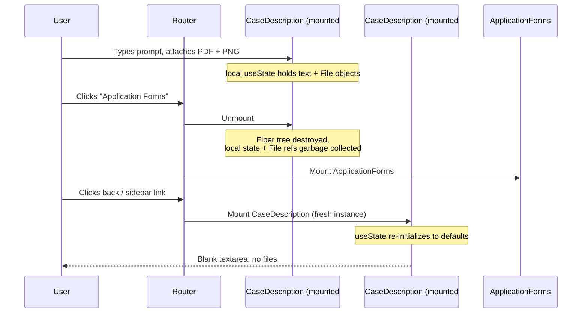
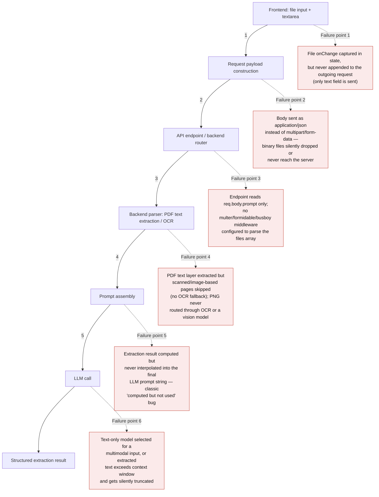
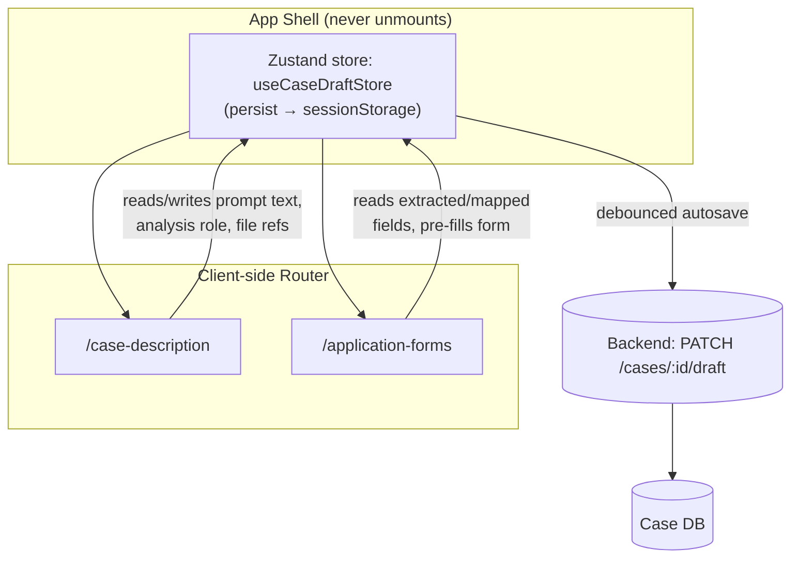
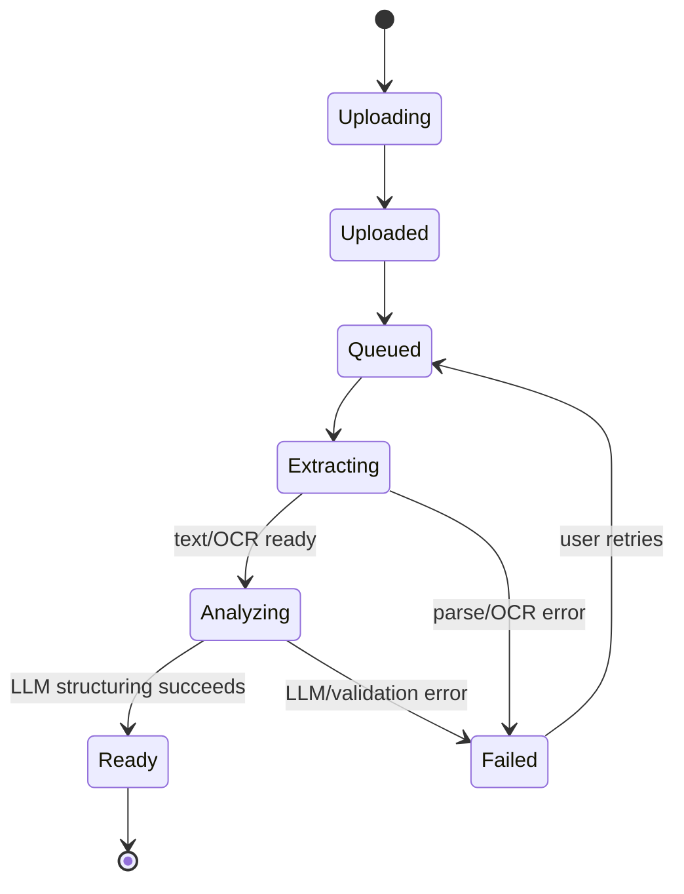
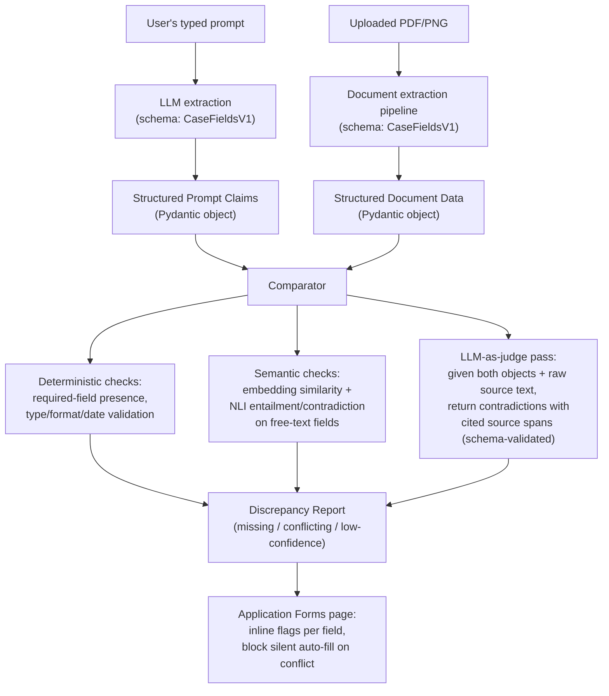

# Technical Assessment Response: Frontend State & AI Workflow Integration

**Scenario:** Lextar AI Document Processing Workflow — Case Description → Application Forms

---

## 1. Root Cause Analysis (RCA)

### 1.1 Why the frontend "forgets" text and files on navigation

The most likely cause is that **Case Description** and **Application Forms** are two separate route-level components in the client-side router (e.g., two Next.js pages/route segments), and the form fields (`textarea`, `<input type="file">` selection) are held in **local component state** (`useState`/`useReducer`) scoped to the `CaseDescription` component itself.

In React, a route change that swaps out the matched component **unmounts** the old component tree. Unmounting destroys all local state and Fiber nodes — there is no automatic serialization or persistence step. When the user navigates back, the router mounts a **fresh instance** of `CaseDescription`, which re-runs its initial `useState`/`useReducer` calls and gets back default/empty values. Nothing "remembers" the previous instance; it was garbage collected.

File uploads are actually more fragile than text: even if the text were persisted, a browser `File`/`FileList` object obtained from an `<input type="file">` is an **in-memory handle scoped to that DOM node**. It is not serializable to JSON, cannot survive `localStorage`/`sessionStorage` round-trips, and does not persist across a route/component swap because the input element itself is destroyed and recreated.

**Root cause in one line:** state lives in a component that gets unmounted, and file handles are never lifted out of the DOM/component into anything durable before that unmount happens.

### 1.2 Why the AI is "blind" to PDFs/PNGs

Because there are four independent layers involved, "blindness" can originate at any of them — and in practice it is usually more than one:

Given the screenshot in the report shows an "Upload Documents" dropzone that says **"Supports PDF and DOCX. Typewritten text only"** — this is a strong hint the actual bug is a combination of **Failure point 4** (no OCR/vision fallback — the system explicitly disclaims scanned/handwritten content) and **Failure point 5** (extracted text is computed server-side but the prompt-assembly step that merges it with the user's typed prompt is broken or missing), which matches Defect 2's description of the AI "focusing on the typed text prompts" as if the document extraction never happened.

---

## 2. Architectural Solution & State Management

### 2.1 Lifting and persisting state

The fix is to stop treating `CaseDescription`'s form state as local, and instead treat the **case** as a durable entity that outlives any single component's mount lifecycle. Three complementary layers:

| Layer | Tool | Role |
|---|---|---|
| In-memory global store | **Zustand** | Single source of truth for the active case draft, shared by both pages without prop drilling |
| Client-side durability | `zustand/middleware` **persist**, backed by `sessionStorage` | Survives route swaps and accidental refresh within the tab session |
| Server-side durability | Debounced autosave to backend (`PATCH /cases/:id/draft`) | Source of truth across devices/tabs/sessions; the real fix for large payloads |

**Why Zustand over the alternatives:**
- **Redux/Redux Toolkit** is a reasonable choice too (and preferable if the org already standardizes on it for devtools/middleware consistency across a larger app), but it's more boilerplate than this problem needs — a single "current case draft" slice doesn't need action creators, reducers, and a store setup for what is fundamentally one object.
- **Context API alone** is not a solution here — Context doesn't persist anything either; it only solves prop-drilling. Using Context without a store still loses state on unmount unless the Provider lives above the routes that unmount (which is possible, but Zustand gives the same "lives above the router" placement plus built-in persistence middleware and selector-based re-render control for free).
- **Raw Browser Storage (`localStorage`/`sessionStorage`) alone**, without a store, works for small string fields but has no reactivity model, a ~5–10MB quota (too small for attached PDFs), and no structured update API — you'd end up hand-rolling what Zustand's persist middleware already does.

The key architectural move is **placing the store provider above the router boundary** (e.g., in `_app.tsx` / the root layout) so the store instance itself is never unmounted when the route changes — only the page components that *read* from it are.

### 2.2 Handling binary file uploads across page transitions

`File` objects cannot be persisted in `sessionStorage`/`localStorage` (not JSON-serializable, size-prohibitive). The correct pattern is to **not keep the file itself in frontend state at all** past the moment of selection:

1. On file selection, immediately stream the file to the backend via a dedicated `POST /cases/:id/files` (or a presigned S3/GCS upload URL) — don't wait for the user to submit the whole form.
2. The backend stores the raw bytes in object storage and returns a lightweight, **serializable** reference: `{ fileId, filename, mimeType, sizeBytes, status: "uploaded" }`.
3. Only this reference object goes into the Zustand store (and therefore into `sessionStorage`/the autosave payload) — small, JSON-safe, and independent of the browser's in-memory `File` handle.
4. The **Application Forms** page never needs the actual bytes; it only needs the `fileId`s to look up processing status/results from the backend.
5. For resilience against a page refresh mid-upload, an `IndexedDB`-backed queue (e.g., via `idb-keyval`) can hold not-yet-uploaded files locally so an interrupted upload can resume — this is optional hardening, not required for the core bug fix.

This single change fixes both defects simultaneously: state loss is solved because nothing large or unserializable lives in component state, and "AI blindness" is mitigated because files are pushed to the backend (and can start processing) the moment they're selected, decoupled from whatever the user does on the frontend afterward.

---

## 3. Data Pipeline & Error Handling

### 3.1 End-to-end pipeline

```mermaid
flowchart LR
    A["Upload\n(PDF / PNG)"] --> B["Validate\nmime type, size, virus scan"]
    B --> C["Object Storage\n(S3 / GCS) + fileId"]
    C --> D["Extraction Queue\n(BullMQ / Celery job)"]
    D --> E{"File type?"}
    E -- PDF --> F["Text-layer extraction\n(pdf-parse / pdfplumber)"]
    F --> G{"Text layer\nsufficient?"}
    G -- No / scanned --> H["OCR fallback\n(Tesseract / cloud OCR)"]
    G -- Yes --> I["Normalized text\n+ page/source metadata"]
    H --> I
    E -- PNG --> J["OCR or multimodal\nvision model pass"]
    J --> I
    I --> K["Prompt assembly:\nuser text + extracted doc text"]
    K --> L["LLM structured extraction\n(schema-constrained / function calling)"]
    L --> M["Pydantic / JSON Schema\nvalidation"]
    M -- fail --> N["Retry w/ backoff\nor flag for review"]
    M -- pass --> O["Persist structured result\nkeyed by caseId"]
    O --> P["Application Forms page\nfetches by caseId"]
    P --> Q["Field-mapping layer:\nextraction schema → form schema"]
    Q --> R["Pre-filled form\n+ provenance per field"]
```

Key design decisions embedded in this pipeline:
- **Async job queue, not a synchronous request/response.** OCR and LLM calls can take seconds to minutes; the upload endpoint should return immediately with a `jobId`/`fileId` and status, not block the HTTP request.
- **Server as source of truth, keyed by `caseId`.** The Application Forms page doesn't depend on anything the Case Description component held in memory — it independently fetches the latest extraction result for the case. This is what makes the pipeline robust to navigation, refresh, and even a different browser tab/device.
- **Schema-constrained LLM output** (Pydantic models on the backend, or a JSON Schema passed via function calling/tool use) instead of free-form text parsing, so malformed output is caught immediately rather than silently corrupting form fields.

### 3.2 UX indicators for the extraction lifecycle

A user should never wonder "did it see my file?" A per-file, per-case status model surfaced as a stepper/badge solves this:

Concretely: a status badge per attached file (`Uploading → Extracting → Analyzing → Ready/Failed`), a case-level progress indicator visible on both pages (since it's driven by the shared store + backend polling/SSE, not local state), toast notifications on completion/failure, and on the Application Forms page each pre-filled field is visually marked (e.g., a subtle highlight + "AI-filled from contract.pdf, p.3" tooltip) so the user can trace *why* a field has the value it does, and easily distinguish AI-filled vs. manually-edited fields.

---

## 4. Cross-Reference Validation & Anomaly Detection

### 4.1 Design

Treat both inputs as **structured, comparable objects** rather than raw text, then diff them programmatically before anything reaches the form:

1. Run the user's typed prompt through the same structured-extraction step as the documents (a lightweight LLM call constrained to the same Pydantic/JSON schema — e.g., `client_name`, `filing_date`, `permit_expiry_date`, `jurisdiction`, etc.).
2. Run the document extraction through the identical schema.
3. Now both sides are typed, field-aligned objects — comparable **without** re-parsing free text every time.

### 4.2 Specific methods, by category

- **Programmatic / deterministic (cheap, run first):** Pydantic/JSON Schema validation to catch missing required fields outright; type and format normalization (e.g., all dates parsed to ISO-8601 before comparison) so `"45 days ago"` in the prompt can be resolved against an explicit `expiry_date` in the PDF; direct equality or fuzzy string matching (Levenshtein/token-set ratio) for short structured fields (names, IDs, case numbers).
- **Semantic comparison (for free-text/narrative fields):** embedding similarity (cosine distance between sentence embeddings) as a cheap first-pass "these two statements are probably about the same thing" filter, followed by a **Natural Language Inference (NLI)** classifier (entailment / contradiction / neutral) — NLI is the right tool specifically for *contradiction* detection, whereas embedding similarity alone only tells you topical relatedness, not whether two statements disagree.
- **AI prompting strategy — grounded LLM-as-judge:** a dedicated verifier prompt (separate call from the extraction call, to avoid the same failure mode marking its own work) that receives both structured objects plus the original source text/pages, and is required to return a strict, Pydantic-validated JSON list of `{field, prompt_value, document_value, severity, source_citation}`. Requiring a **source citation** (a quote or page reference) for every flagged item is the key defensive step — it forces the model to ground its claim in actual text rather than hallucinating a conflict, and gives the reviewing user something to verify against.
- **On "Cross-Attention" specifically:** true cross-attention weight inspection is a model-internals interpretability technique, useful if you're fine-tuning a custom encoder over prompt+document pairs, but it isn't something you get access to (or need) when calling a hosted LLM API. For a production system, the pragmatic equivalent is the LLM-as-judge pass above — it's functionally "let the model attend across both sources," just done via prompting rather than internal attention weights, and it's inspectable/auditable, unlike raw attention maps.
- **Guardrails:** wrap the verifier call with schema-enforcing libraries (e.g., Instructor, Guardrails AI, or plain Pydantic `model_validate` with retry-on-failure) so a malformed judge response triggers an automatic retry rather than corrupting the discrepancy report.

### 4.3 UX for flagged discrepancies

Severity-tiered flags (`contradiction` / `missing_field` / `low_confidence`) rendered inline next to the relevant Application Forms field, each showing both conflicting values and their source (prompt vs. `contract.pdf p.3`). Hard contradictions block auto-fill of that specific field (leave it blank with a warning rather than silently picking one source) and require explicit user resolution; missing-field flags simply prompt the user to fill the gap manually.
